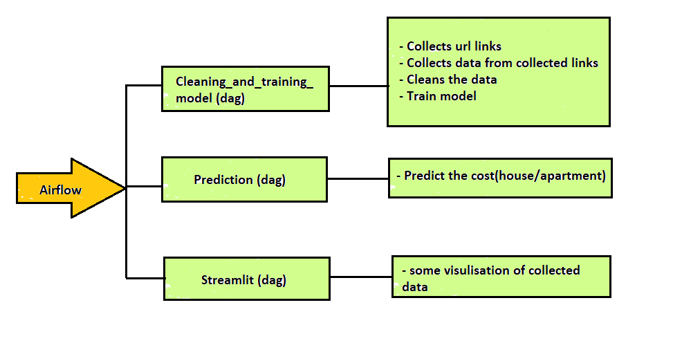

# Data Pipeline in Airflow 

## 📖 Table of Contents
1. [Introduction](#introduction) 📌 
2. [Description](#description) 📜 
3. [Airflow Dags](#airflow_dags) 🚀 
4. [Installation](#installation) 🔧 
5. [Pipeline](#pipeline) 📊 
6. [Completion](#completion) 🏁 

## 📌 Introduction
This project, part of the AI Bootcamp in Gent at BeCode.org, aims to create a pipeline from data cleaning to prediction with data visualization.

## 📜 Description
This Airflow pipeline will   
* Scrape data from houses and appartments on sale
* Clean the data with pandas
* Train model
* Predict the price for given details
* Data Visualisation

## 🚀 Airflow Dags
### cleaning_and_training_model (dag)

This dag contains 4 parts which happens everynight:
* collects url of houses and appartment on sale.
* collects data of houses and appartments from url list.
* cleans collected data
* train regression model ( for this project Random Forest Regression is being used)

### prediction (dag)

This dag doesnot run everynight. once triggered dialoug box will be displayed, after filling details of a house predicted price (based on trained model) will be displayed. 
note :trigger prediction dag after cleaning_and_training_model dag to get updated prediction.

### streamlit (dag)

This dag doesnot run overnight. once triggered and starts running open `http://localhost:8501/` to visit streamlit page.
Page contains data explorations , visualisations and some interactive visualisation.

## 🔧 Installation  

- Clone this repository.
- Install the required modules using `pip install requirements.txt`.

## 📊 Pipeline
This can be done by
* Clone the repo.
* Redirect to airflow.
* Open the terminal and activate the environment
* Run `export AIRFLOW_HOME="$(pwd)"` - this will set the current directory as home for airflow
* Run `pip install "apache-airflow==${AIRFLOW_VERSION}" --constraint "https://raw.githubusercontent.com/apache/airflow/constraints-${AIRFLOW_VERSION}/constraints-${PYTHON_VERSION}.txt"` to install airflow in your environment
* Run `airflow webserver -p 8080`to access the airflow UI.
* Run `airflow scheduler`to update UI if you make any changes in .py files.
* Open `http://localhost:8080/home` from your browser to view and access airflow UI and its logs. (you can also view logs in logs file that created in repo ).

## 🏁 Completion 
Name - Mythili Palanisamy  
Team type - solo
